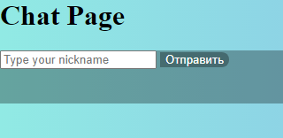
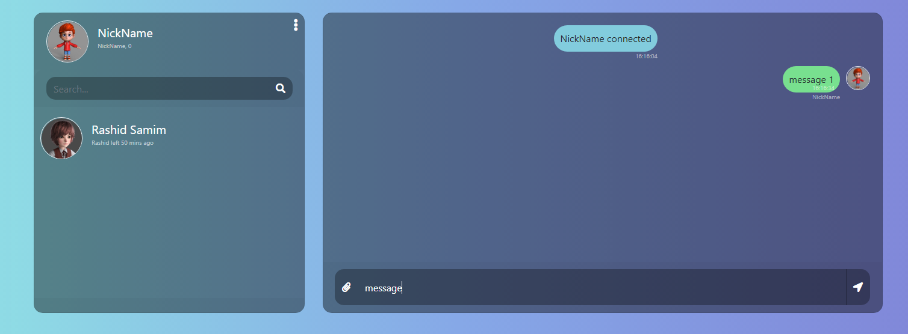

# WebChat

---
_(Незаконченная тестовая версия)_

Реализовано:

- Сокет соединение
- Отправка сообщений на сервер и пользователям, время сообщений, сообщения о подключении/отключении пользователя
- Bootstrap оформление
- Сессии

---
Сервер **Apache Tomcat**

Собрано с **Apache Maven**

Использовал:
- Javax Servlet API 4.0.1
- Javax Websocket API 1.1
- Google GSON 2.8.8
- JSP
- Bootstrap

---
Главная страница _localhost:8080/_

Страница чата _localhost:8080/chat_

